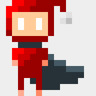

<link rel="stylesheet" href="https://cdn.jsdelivr.net/npm/bulma@0.9.1/css/bulma.min.css">

    <article class="media">
        

            <figure class="image is-128x128">
                
            </figure>
        

        

            

                <h1>Hi! I'm Maxwell</h1>
                <ul>
                    <li>
                        I'm a CS undergraduate in New York University
                    </li>
                    <li>
                        I mostly code in <i class="fab fa-python"></i>Python, sometimes <i class="fab fa-js-square"></i>Javascript, <i class="fab fa-java"></i>Java or C++
                    </li>
                    <li>
                        I play soccer(amateur level). Sometimes I draw stuff and play chess(also amateur level)
                    </li>
                    <li>
                        Drop an issue here if you have any cool ideas you wanna share (or internship offers 👻 )
                    </li>
                </ul>
            

        

    </article>

